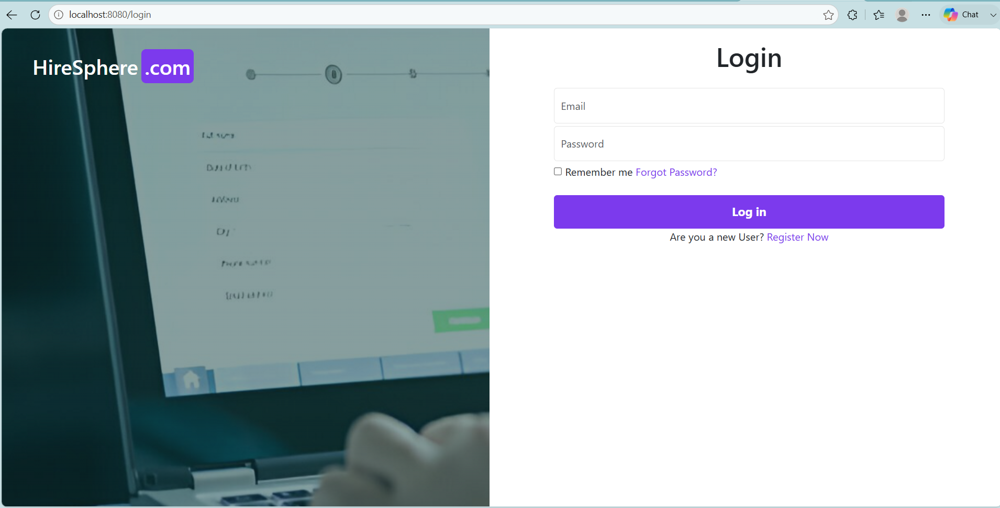
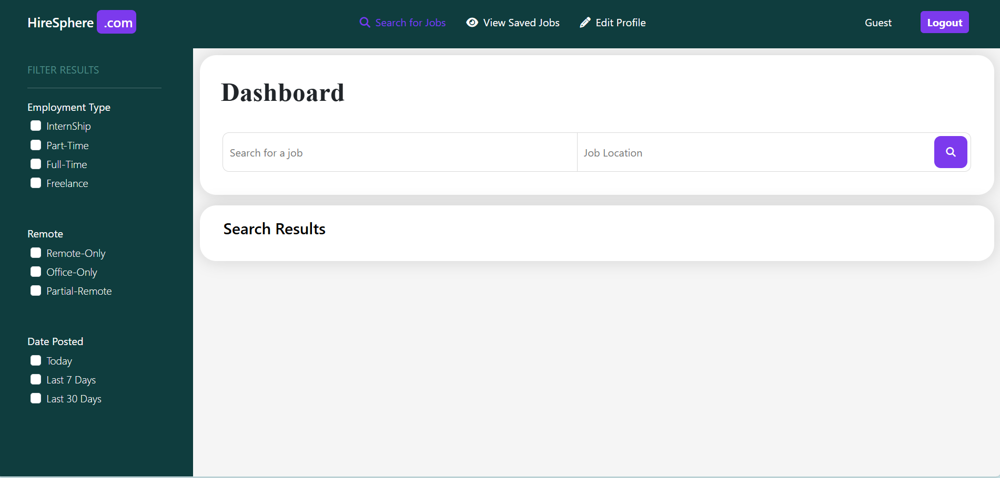

# HireSphere

The **HireSphere** project aims to create a robust and user-friendly platform for job seekers and recruiters using modern Java and Spring technologies. It enables recruiters to post jobs, manage applicants, and candidates to search and apply for jobs through a secure, role-based system. The application is currently under development, with several core functionalities implemented and additional features being actively developed.

  
  
  

## Technologies Used

- **Java 21** – Robust and versatile programming language for backend development.
- **Spring Boot 3** – Simplifies application development with embedded servers and production-ready features.
- **Spring MVC** – Implements the MVC architecture for clean and maintainable code.
- **Thymeleaf** – Server-side template engine for dynamic web pages.
- **Spring Security** – Provides authentication and role-based authorization.
- **Spring Data JPA & Hibernate** – Handles ORM and database interactions efficiently.
- **PostgreSQL** – Relational database for persistent data storage.
- **Lombok** – Reduces boilerplate code using annotations.
- **Bootstrap** – Creates a responsive and modern user interface.

## Tools & Development Environment

- **IDE:** IntelliJ IDEA
- **Build Tool:** Maven
- **Version Control:** Git & GitHub

## Implemented Functionalities

- User Registration & Login
- JWT/Spring Security Authentication
- Role-Based Access Control (Admin, Employer, Candidate)
- Job Posting & Management
- Job Search & Filtering
- Apply for Jobs
- Candidate Profile Management
- Employer Dashboard
- Secure Database Integration with PostgreSQL
- Responsive UI using Bootstrap
